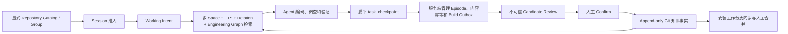

# Shared Context 在 Mew 上的迭代开发总结

> 时间范围：2026-08-18 至 2026-08-28  
> 证据范围：Mew/Codex 主要开发会话、当前 Git 历史、ADR、技术设计与验收报告。

## 总结

这轮 Mew 迭代不是简单堆叠功能，而是完成了两次关键架构纠偏：

1. 从“用户先选择 Space”改为“Agent 先理解 Task，再动态发现相关 Space”。
2. 从“Hook 机械 Capture 证据”改为“Agent 直接提交高价值结论，服务端负责生命周期、幂等与恢复”。

最终目标始终是：减少跨成员、跨端、跨 Agent、跨 Session 对同一工程问题的重复理解、判断和验证，而不是共享聊天记录。

主要会话主线可以概括为：

> 重构 Space 自动推断与检索 → 设计 Repo 范围准入 → 设计跨机器知识共享 → 分析真实会话运行问题 → 分阶段修复 → 再次人工验证 → Direct Checkpoint 定稿

## 为了解决什么问题

### 1. 降低 Context Cold Start

需求切换到另一位开发者、另一个端、另一个仓库或另一个 Agent 后，团队经常需要重新阅读 PRD、搜索代码、理解历史决策并重复验证。Shared Context 希望让已经形成的工程认知成为后续工作的起点。

### 2. 消除手工 Space 路由

早期模型把 Workspace 绑定到唯一 Space，但一个仓库可能同时承载多个需求，同一仓库中的多个 Agent 也可能处理不同任务。Workspace 只能说明“代码在哪里”，不能说明“当前为什么修改代码”。

因此，Space 应继续作为稳定的知识治理容器，但当前 Task 与哪些 Space 相关，应由系统根据 Working Intent 动态推断。

### 3. 建立代码与历史决策之间的可解释关联

全文搜索无法稳定回答以下问题：

- 当前文件或 Symbol 为什么存在？
- 它依赖哪个 API、Schema 或跨端契约？
- 哪些历史 Context 对本次改动形成约束？
- 修改它可能破坏哪些已经验证的结论？

系统需要稳定 Context 事实与可失效、可重建的 Engineering Graph，而不能把路径相似度当作工程事实。

### 4. 降低知识沉淀成本，同时保持信任边界

机械记录工具调用会产生大量低价值数据，却不能判断什么结论值得长期保存；让用户或 Agent 手工填写复杂 Proposal，又会制造新的 Context Tax。

最终方案让 Agent 直接提交聚焦的 Claim、Evidence 和 Unknown，由服务端负责生命周期和恢复。所有 Candidate 在人工确认前仍是不可信草稿，避免 AI 输出直接污染团队知识。

### 5. 控制隐私和跨机器协作边界

全局安装的 Hook、Skill 和 MCP 不能在任意目录自动参与。系统需要显式 Repository Catalog、会话准入和本地路径隔离，同时又要让不同成员通过稳定 RepositoryId 和 Git 工作分支共享同一份知识事实。

## Timeline

| 时间 | 阶段 | 要解决的问题 | 形成的方案 |
|---|---|---|---|
| 8/18–8/19 | 基础设施 | 建立可信、可恢复的知识底座 | Rust Workspace、稳定 ID/Event Schema、DAG Reducer、append-only Git、SQLite 投影、搜索、CLI/MCP、Codex/Cursor Adapter、安装与 NPM 分发 |
| 8/20 | 第一次架构重置，Mew #107–#125 | `Workspace → 唯一 Space` 无法表达同仓多需求、并行 Agent 和任务切换 | 删除 WorkspaceBinding，改成 Task-first；建立 TaskSession、Working Intent、不可变 Intent Revision、`Task → 0..N Space` 动态关联和可解释 Context Pack |
| 8/21–8/22 | Engineering Graph，#138–#154 | 全文搜索无法回答“这段代码为何存在、依赖什么契约” | 引入可读 RepositoryId、ArtifactLocator、EngineeringReference、ContextRelation 和历史 Graph Snapshot；Artifact Focus 改为一次请求级精确查询，移动或重命名时不猜测 |
| 8/22–8/23 | Low-tax Capture v1，#155–#172 | 希望自动把探索、修改和测试沉淀成知识 | 建立 WorkEpisode、Hook Capture、Checkpoint、Candidate Builder、Review/Discard/Confirm 和原子确认；8/23 首次完成 Hook-to-Confirm 闭环 |
| 8/23–8/24 | 黑盒与动态场景，#173–#178 | 局部单测不能证明跨 Hook/MCP/Runtime/Git 链路 | 增加 Codex/Cursor 动态 Scenario Runner、PreCompact、TurnStop 恢复、双 Session 隔离和 120 次合成回放。该回放属于 synthetic regression，不是真实模型循环证据 |
| 8/24–8/25 | Repository 范围准入，#181–#196 | 全局 Skill/MCP 在无关目录参与会产生隐私风险和额外开销 | 显式 Repository Catalog/Group；Session 分为 Direct、Group、Disabled；只有准入会话获得短 activation marker，随后才加载完整 workflow |
| 8/25–8/26 | 团队共享，#198–#204 | 绝对路径和生成 UUID 无法跨成员、跨 checkout 对齐 | RepositoryId 改为团队约定的 `FE`、`iOS`、`Android` 等可读名称；每个安装只写自己的 `shared-context/<installation-id>` 分支，默认分支只读，由人工 PR/merge 集成 |
| 8/25 | 第一次真实 Android 会话 | 自动化全绿，但真实使用成本过高 | 发现 92 条 Capture 全部未消费；`task_checkpoint` 8 次中前 7 次字段错误；Shared Context 占会话 token 流量约 38%–40%；并发 Hook 争抢 Capture 锁导致 5 秒超时 |
| 8/26–8/27 | 系统性修复，#205–#224 | 补齐 Relation、Reference、Related Space、召回质量、真实 payload、Schema 和 Hook 热路径 | 完成 typed ContextRelation、EngineeringReference、Related Space 召回、Intent bootstrap、FTS 强度门槛、strict Focus fallback、真实宿主 payload 和并发 Hook 优化 |
| 8/27 晚 | 第二次真实验证 | Capture-first 虽已公开，但 Agent 仍不会自然使用 | 新会话产生 102 条 Capture，却从未调用 `task_capture_list`；Agent 继续手写复杂 Evidence，仍发生字段错误和重试，证明 Capture 选择步骤本身就是新的 Context Tax |
| 8/28 | 第二次架构重置，#225–#229 | 从根本上消除复杂 Checkpoint、错误重试和机械 Capture | 原地简化 `task_checkpoint`；删除 Capture Store/List/Ingestion；服务端解析 Task/Intent/Episode，以规范化内容生成稳定操作键，原子持久化 Receipt 与 Candidate Build Outbox |

8/23 的“M1–M4 完成”只是第一版架构闭环。8/25 和 8/27 的真实会话证据推翻了其中 Capture 相关的产品假设，因此最终方案应以 8/28 的 Direct Checkpoint 为准。

## 最终整体方案



### Hook

Hook 只负责准入、提醒和非事实 TaskSignal，不再生产 Evidence，也不保存 Prompt、Transcript、原始命令或工具输出。

### Working Intent

Working Intent 只是当前任务理解和检索线索，不是事实、证据或 Space 归属。相同语义的更新保持幂等，Artifact Hint 和 Interface Hint 只能参与文本召回。

### Retrieval

检索组合以下通道：

- Working Intent 和 Context/Space 文本，但必须经过自动召回强度门槛；
- Primary/Related Space Association；
- 稳定 ContextRelation；
- 精确 Engineering Graph 路径；
- Graph 不可用时的严格 full-locator 文本 fallback。

当前方案没有引入 embedding 或向量数据库，重点是确定性、可解释性和可审计性。

### Direct Checkpoint

模型只提交以下四个顶层字段：

```json
{
  "agent_kind": "codex",
  "external_session_id": "external-session",
  "claims": [],
  "unknowns": []
}
```

每个 Claim 只包含结论、理由、适用条件和自包含 Evidence 摘要。调用方不再填写 TaskId、IntentId、EpisodeVersion、boundary、transport key 或其他生命周期字段。

### Server-owned Lifecycle

服务端负责：

- 寻找当前 Task 和 Intent；
- 创建并关闭 Work Episode；
- 根据 Task、Intent 和规范化内容生成稳定操作身份；
- 原子持久化 Checkpoint Receipt 与 Candidate Build Outbox；
- 让相同作用域、相同内容的超时重试收敛到同一 Checkpoint、Episode、Build 和 Submission；
- 先返回持久化 ACK，再由 `candidate_list/get` 有界恢复 Candidate Build。

### Candidate 与人工确认

Agent Evidence 只是 attestation。Candidate Builder 生成的分析、置信度、关系判断和 Space 推荐都属于不可信 Review 数据。

只有用户显式执行 `candidate_confirm` 后，系统才会产生 accepted Context revision、Space Association、Publication 和 Confirmation 等长期知识事实。

### 存储与团队同步

- Git 保存 append-only、可审计的长期事实，包括 Candidate proposal 和人工确认后的知识事实。
- SQLite 保存 Task、Checkpoint Receipt、Build Outbox、Candidate Review、索引及可重建 Engineering Graph 等本地状态。
- 不同机器共享稳定 RepositoryId，但保留各自的绝对路径和 Catalog。
- 每个安装只推送自己的 Installation Work Branch；默认分支通过人工 PR/merge 集成，不自动写入或 force push。

## 当前结果与边界

### 已形成的结果

- 当前公开 MCP 工具为 16 个。
- 100 个 Codex Host Session 探针中，99 个成功暴露并调用工具。
- 实际发生调用的 99/99 首次参数合法。
- 零字段重试、零重复 Checkpoint 调用、零 Capture 残留。
- Checkpoint ACK 的通过用例低于 P95 250ms、P99 500ms 门槛。
- Direct Evidence、ContextRelation、EngineeringReference、Related Space、跨 checkout 召回、安装、NPM、格式和 Clippy 门禁均有通过证据。

### 明确接受或排除的边界

- 当前继续信任 Agent 提供的 SessionId，没有引入 MCP transport 绑定。
- Session lease 10.2 没有实施。
- 项目尚未上线，因此没有保留 `task_checkpoint_v2` 或旧公共契约兼容层；已知旧 Runtime Schema 通过重装处理。
- 不提供后台同步、自动 PR、自动确认或默认分支直接写入。

### 尚未完全关闭的问题

- Cursor 目前只有契约和公开进程证据，真实模型循环仍待验证。
- Candidate 重复/矛盾识别、Space 推荐质量仍需要人工把关。
- `validate --staged` 的 Secret/PII 扫描等 8/27 审计项尚未看到对应修复。
- Artifact Focus 和检索仍可能受到外层调度及环境负载影响。
- 完整 workspace 测试两次在同一 retrieval-quality 断言上波动失败，虽然该单测随后独立通过，因此验收报告没有宣称 monolithic workspace 全绿。

## 参考资料

- [产品目标](../readme.md)
- [领域语言](../CONTEXT.md)
- [技术设计](../technical-design.md)
- [验收报告](./acceptance-report.md)
- [ADR-0001：Readable Repository Identities](./adr/0001-readable-repository-identities.md)
- [ADR-0002：Installation Work Branches](./adr/0002-installation-work-branches-for-remote-knowledge.md)
- [ADR-0003：Direct Checkpoints and Server-owned Lifecycle](./adr/0003-direct-checkpoints-and-server-owned-lifecycle.md)
